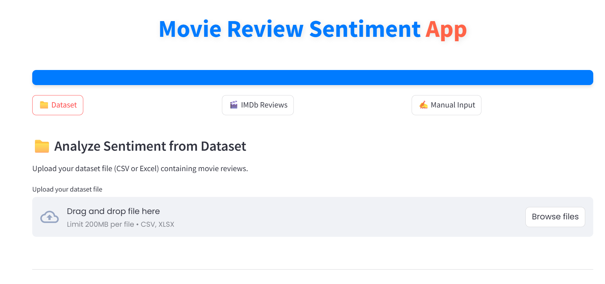
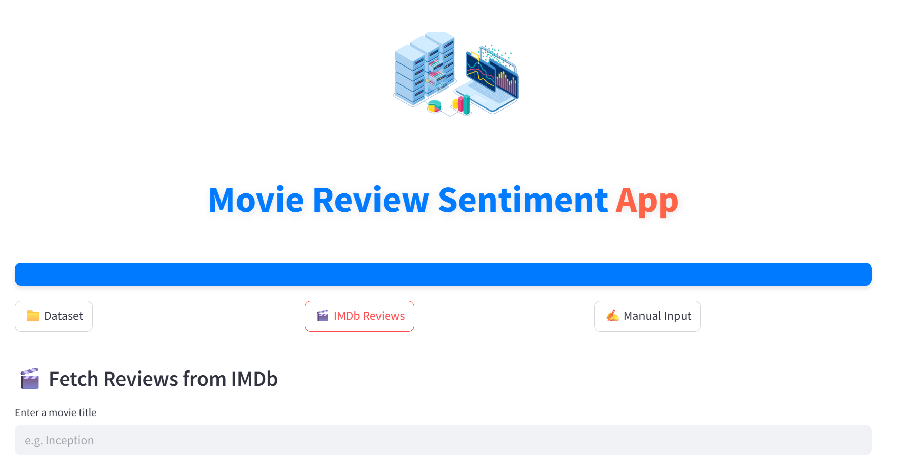
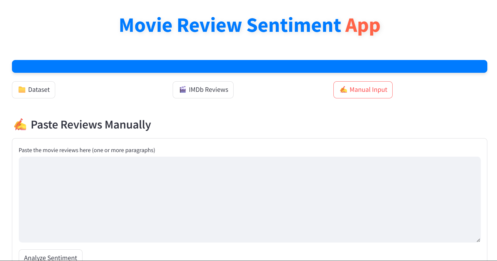

# Movie Review Sentiment Analyzer

A BERT-based sentiment analysis web application that classifies IMDb movie reviews into **Positive** or **Negative**. It supports manual review input, live IMDb scraping for sentiment prediction, and dataset-based batch predictions with downloadable results. Deployed via Docker and Kubernetes, accessible  via [moviereviewsentimentanalyzer.com.np](https://moviereviewsentimentanalyzer.com.np).

---

##  Features

* Manual Input Sentiment Analysis
* IMDb Review Scraper + Analysis
* Dataset Upload with Review Column Prediction
* Download Results as CSV
* Interactive Plots and Feedback

---

##  Model Details

* **Architecture:** BERT (`bert-base-uncased`)
* **Trained on:** IMDb 50K Dataset
* **Frameworks:** PyTorch, Transformers (HuggingFace)
* **Preprocessing:** Tokenization with padding, truncation (max length: 256)
* **Training Time:** 3 epochs on stratified 80/20 split

###  Performance Metrics

* **Accuracy:** `92.85%`
* **Precision/Recall/F1:**

```
              precision    recall  f1-score   support

           0       0.94      0.92      0.93      5000
           1       0.92      0.94      0.93      5000

    accuracy                           0.93     10000
   macro avg       0.93      0.93      0.93     10000
weighted avg       0.93      0.93      0.93     10000
```

---

##  Dataset

* Source: [IMDb 50K Movie Review Dataset](https://www.kaggle.com/datasets/lakshmi25npathi/imdb-dataset-of-50k-movie-reviews)
* Balanced: 25K Positive / 25K Negative
* Split: 80% Train, 20% Test

---

##  Project Structure

```bash
├── app.py                      # Streamlit web app
├── bert_sentiment_model/      # Saved BERT model + tokenizer
│   ├── config.json
│   ├── pytorch_model.bin
│   ├── tokenizer_config.json
│   ├── vocab.txt
│   └── special_tokens_map.json
├── Dockerfile
├── requirements.txt
├── README.md
├── notebook.ipynb             # Training and evaluation
├── test_scraper.py            # Unit tests for scraper functionality
├── utils/
│   ├── scraper.py             # IMDb scraping logic
│   └── predict.py             # Inference logic for prediction
```

---

##  Setup Instructions

### 1. Clone the repository

```bash
git clone https://github.com/your-username/movie-review-sentiment-analyzer.git
cd movie-review-sentiment-analyzer
```

### 2. Create environment & install requirements

```bash
pip install -r requirements.txt
```

### 3. Run locally

```bash
streamlit run app.py
```

---

##  Deployment

### Docker

```dockerfile
# Dockerfile
FROM python:3.10
WORKDIR /app
COPY . .
RUN pip install -r requirements.txt
CMD ["streamlit", "run", "app.py", "--server.port=8501", "--server.enableCORS=false"]
```

```bash
docker build -t bert-sentiment-app .
docker run -p 8501:8501 bert-sentiment-app
```

### Kubernetes (AKS or Minikube)

* Use Kubernetes deployment YAMLs
* Deploy Docker image to AKS via Azure Container Registry or GitHub Actions

---

##  Endpoints (App Sections)

| Feature             | Description                                          |
| ------------------- | ---------------------------------------------------- |
| Manual Input        | Type any review manually and get sentiment           |
| IMDb Scraper        | Enter IMDb movie URL, scrape 10 reviews, analyze     |
| Dataset Upload      | Upload CSV with `review` column, get batch sentiment |
| Download Prediction | Download the annotated CSV                           |

---

##  Tech Stack

* **Frontend:** Streamlit
* **Backend:** Python, Transformers, PyTorch
* **Scraping:** Selenium (ChromeDriver)
* **Deployment:** Docker, Kubernetes (AKS)
* **Notebook:** Jupyter, Kaggle Kernel

---

##  Sample Predictions

```python
predict_sentiment("I love this movie!")  # Positive
predict_sentiment("This movie was terrible.")  # Negative
```

---

##  App Screenshots

### Screenshot 1: App Overview
This is the main interface of the app, where users can choose between different input options.


### Screenshot 2: IMDb Scraping
This screenshot shows the IMDb scraping feature where users can enter an IMDb movie URL to fetch reviews and analyze sentiment.


### Screenshot 3: Manual Input Sentiment Analysis
Here, users can type any movie review manually, and the app will predict its sentiment as positive or negative.


---

##  External Access

* Public IP: `http://172.212.76.116`
* Domain: `https://moviereviewsentimentanalyzer.com.np`

---

##  Author

**Sangam Paudel**

* Email: [sangampaudel530@gmail.com](mailto:sangampaudel530@gmail.com)
* Kaggle: [@sangampaudel530](https://www.kaggle.com/sangampaudel530)

---

##  License

MIT License. See [LICENSE](LICENSE) for more information.

---

##  Acknowledgements

* [IMDb Dataset](https://www.kaggle.com/datasets/lakshmi25npathi/imdb-dataset-of-50k-movie-reviews)
* HuggingFace Transformers
* Streamlit for app interface
* Azure Kubernetes Service (AKS) for deployment

